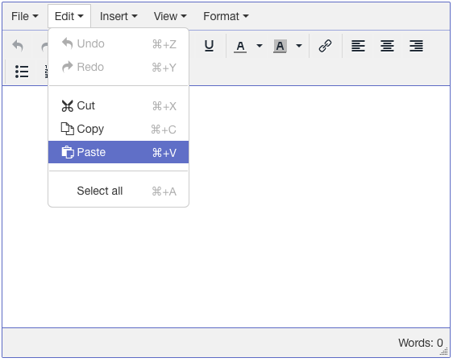

# tinymce-polaris
TinyMCE theme for use with Shopifys Polaris style guide



## Usage
To use this skin simply clone the polaris directoy into the `./polaris` folder in your TinyMCE skins folder.
or download an extract the polaris.zip file into your TinyMCE skins folder.

In your tinymce.init() function you can call the skin with the setting:

```
skin: 'polaris',
``` 

